CUDA Path Tracer
================

**University of Pennsylvania, CIS 565: GPU Programming and Architecture, Project 3**

* Rose Kelly
  * [LinkedIn](www.linkedin.com/in/rose-kelly-b480b01a8)
* Tested on: Windows 11, i7-13700F @ 2.10 GHz 16GB, RTX 4060-Ti 8GB (PC)

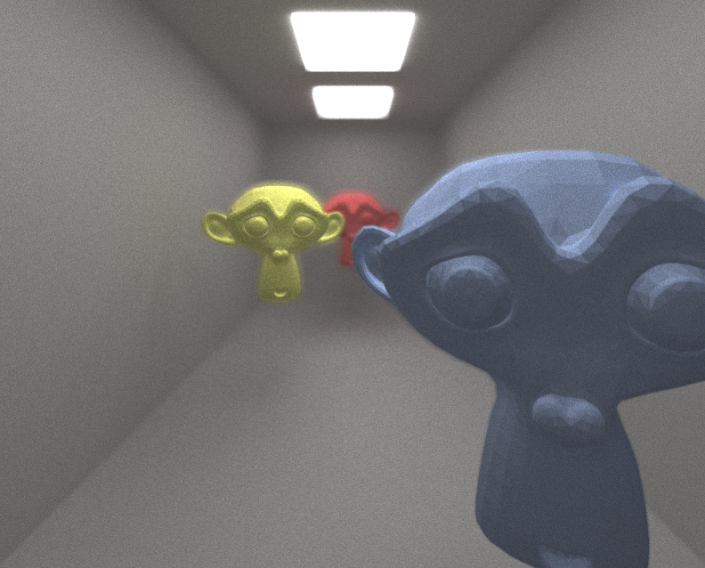

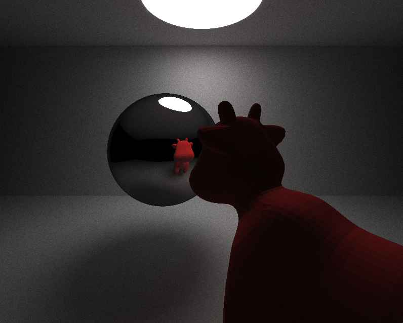

## Features

#### Perfectly Specular and Diffuse Materials
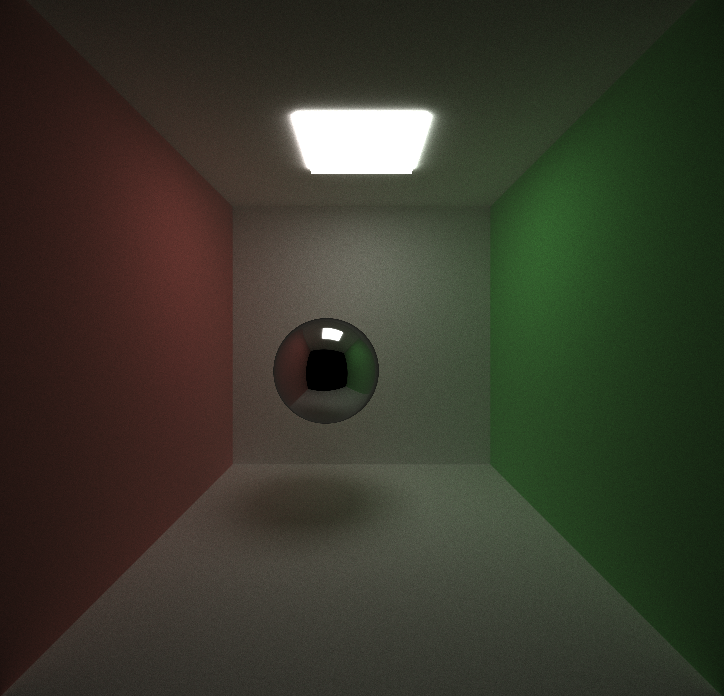 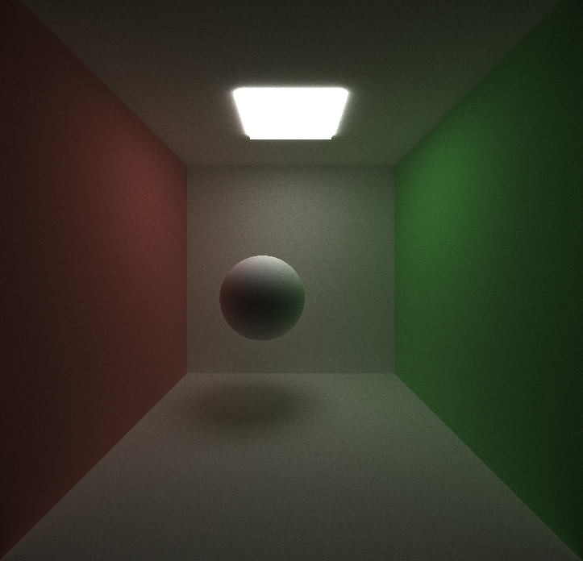

#### Sorting Rays by Material
 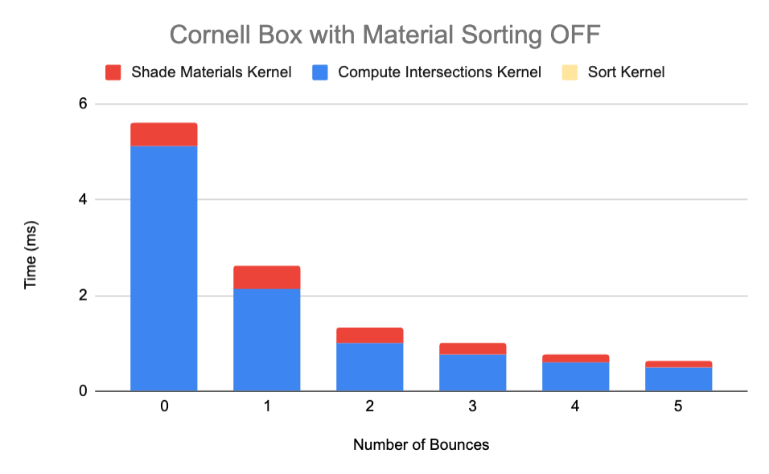 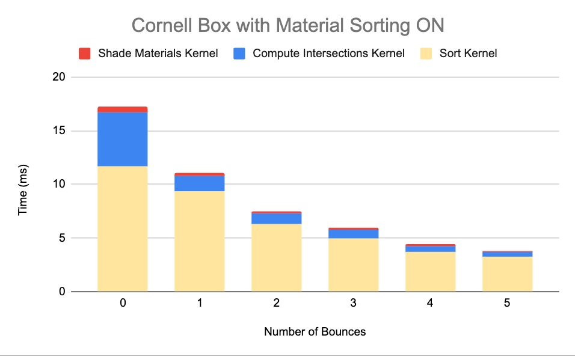
 
I also implemented a feature to sort paths by material type before processing their bsdf and pdf. In theory this should improve performance by reducing thread divergence since different materials take different paths in the shade and scatter ray kernels and this slows performance within warps since if/else statements are serialized in a warp. Grouping paths of the same material in the buffer should make most warps only have one type of material, thus saving time by not having to run multiple if/else paths in serial execution. In practice this actually made my path tracer perform worse. This is likely because the saved time was minimal due to only having two materials implemented, making the overhead of running thrust's sort more costly than the saved time from less thread divergence. As you can see in the graph above, the time it takes to sort the rays is more than double the combined time to compute intersections and shading, so the overhead for this feature is massive, making it a bad fit for the small number of materials in the cornell box scene.

#### Stream Compaction to Terminate Dead Rays
 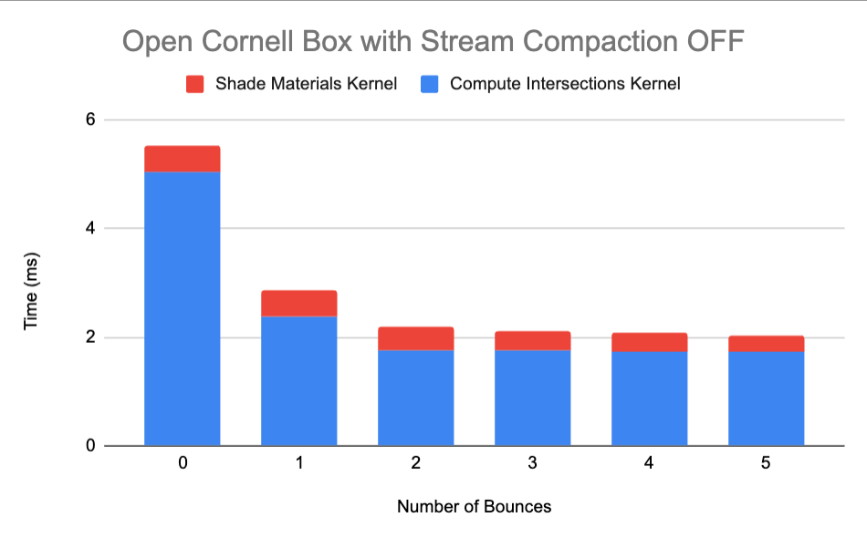 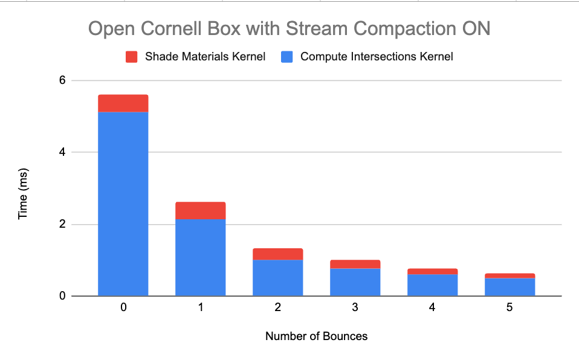

 | Number of Bounces	| Unterminated Rays (Open Box) | Unterminated Rays (Closed Box) |
| ------------- | ------------- | ------------- |
|0	|640000	|640000|
|1	|522868	|632841|
|2	|362096	|623890|
|3	|279658	|616097|
|4	|222683	|608827|
|5	|179838	|601856|

I implemented stream compaction to remove "dead" paths that no longer would contribute to the image, and thus would be wasting resources to allocate threads for. I used thrust's remove_if function to remove any paths that had no more remaining bounces (and used the remaining bounces variable in my pathtracing code to set a path as terminated in the case of it hitting nothing or a light). 

As the above graphs show, in an open scene (in this case an open cornell box), stream compaction increases performance significantly, especially by the 5th bounce when many rays have bounced out of the box and thus are no longer usable.

 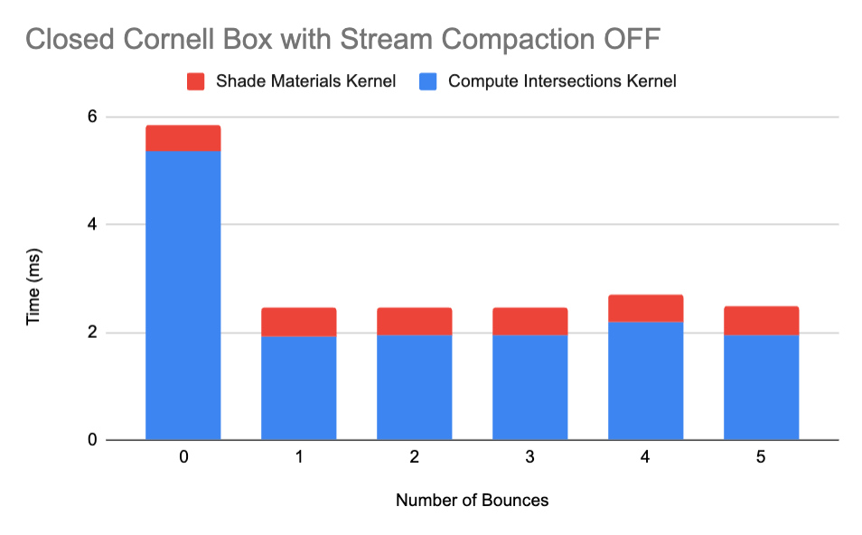 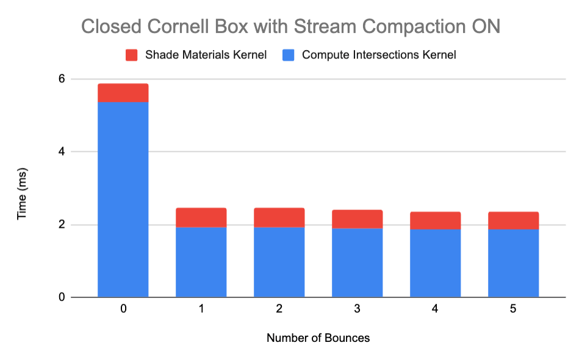

The above graphs reflect the impact of stream compaction in a closed cornell box. As you can see, there appears to be almost no difference between when stream compaction is on and off when the box is closed. This is likely due to the fact that when the box is closed, far fewer rays terminate each bounce since none are bouncing out of the box into oblivion. This is supported by the fact that the number of unterminated rays at the 5th bounce are 601856 for a closed box (not so far from the 640000 the iteration started with) while in an open box the 5th bounce has only 179838 unterminated rays, explaining the significant performance boost from not allocating threads for all of those terminated rays.
 
#### Stochastic Sampled Antialiasing
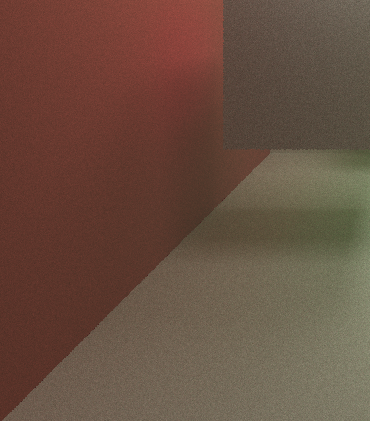  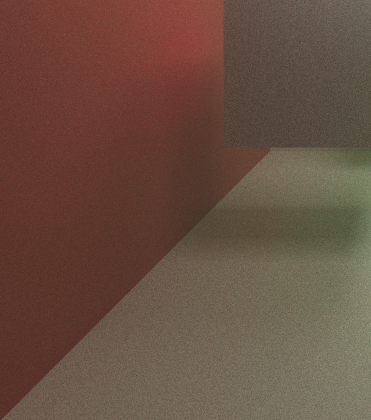

I implemented stochastic sampled antialiasing as described in the "stochastic sampling" section of this page: https://paulbourke.net/miscellaneous/raytracing/. My implementation splits each pixel up into 16 squares and as the pathtracer iterates, the rays cast from the camera through each pixel also iterate through the 16 sub-pixel squares by shooting a ray through a random location in that iteration's sub-pixel square. The result of jittering the ray is that the color of each overall pixel is the combination of random rays through the 16 sub-pixels. Harsh aliasing occurs without this method because the ray hits the same location in the scene each time on the first bounce even if the pixel contains multiple objects, like an edge of an object, which leads to the pixelated edges associated with aliasing. This method allows the pixel to reflect the combined colors of multiple objects contained in the pixel, creating a smoother, blurred edge instead of harsh pixelation.

#### Depth of Field Effect
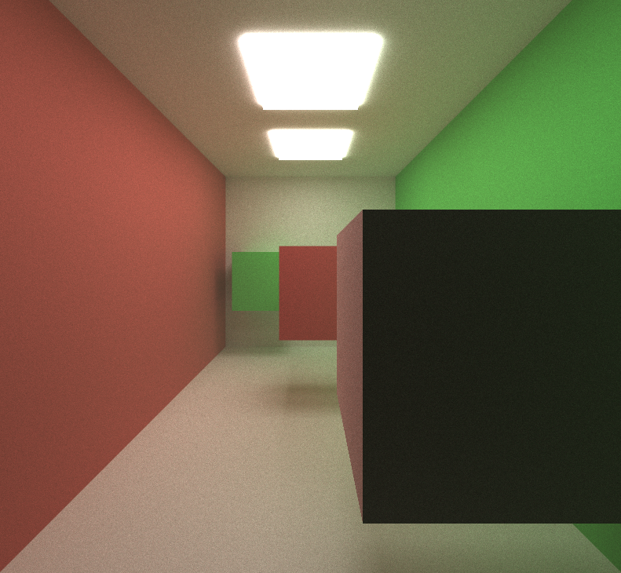  

I also added a depth of field effect. I jitter the ray in similar way as described in the antialiasing section to create a blurred depth of field effect. If objects are close to the depth of field they will have relatively little jitter and will be sharper, while objects far from the depth of field will be blurry and appear out of focus.

#### GLTF File Reading

 I added glTF file loading as a feature using the tinygltf library. This essentially consisted of loading the file using the library and accessing the vertex data for the mesh and indices indicating what order to use the vertex data to create triangles. I then used those triangles to create the BVH tree detailed below. The file reading and triangle construction is done on the CPU.
 
#### BVH TREE
 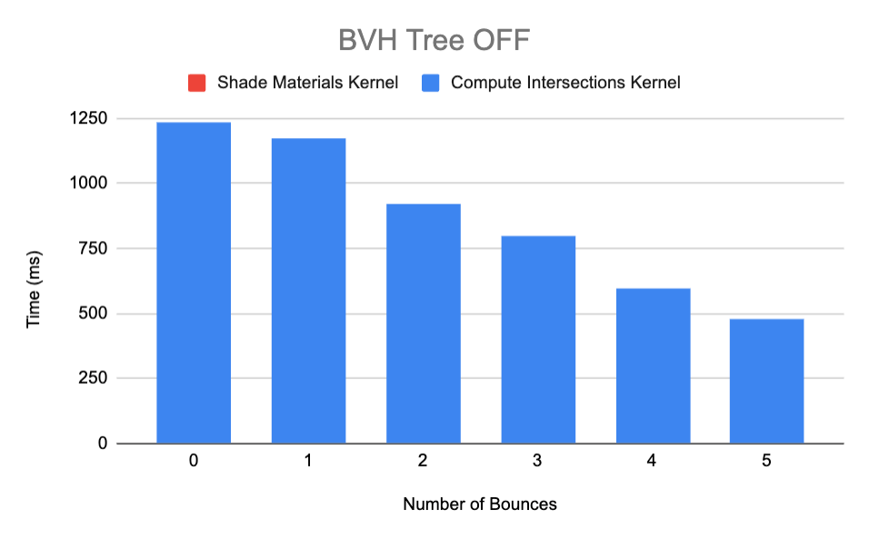 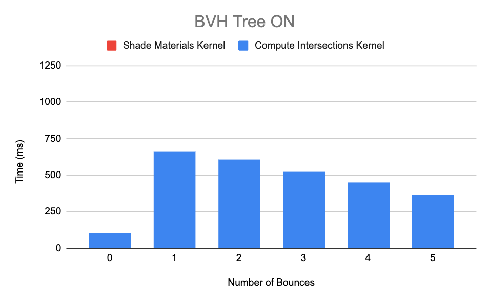

These times were taken from 1 iteration of rendering the below image:

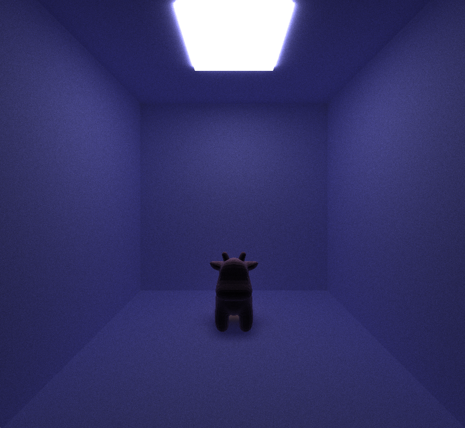

 | BVH OFF	| BVH ON |
| ------------- | ------------- |
|5564.163 ms/frame	| 3266.386 ms/frame	|

I implemented a BVH tree acceleration structure based on the notes in the Physically Based Rendering book here: https://pbr-book.org/3ed-2018/Primitives_and_Intersection_Acceleration/Bounding_Volume_Hierarchies. The actual implementation essentially consists of building a bounding volume around all of the triangles and then splitting the triangles into groups and sub groups and so on, each with their own bounding volume to create a hierarchy of bounding volumes the program can traverse to more quickly test intersection.  I split the groups based on whether or not the centers of the triangles were above or below the midpoint of the longest axis of the bounding volume encompassing them.
Intersection for a ray is tested using a BVH tree by first testing if the ray hits the highest level bounding volume and if so it tests the bounding volume's two children. This continues down the tree to the "leaves" which are the actual triangles. This should reduce the amount of intersection tests needed to be done since instead of brute force checking intersection with every triangle, whole groups of triangles can be ignored if the ray doesn't intersect with their bounding volume. As shown in the graph above, this considerably cuts down on the time it takes to compute intersections for even mildly complex triangle meshes.

The BVH tree construction was done on the CPU and then buffered to the GPU, and the traversal is done on the GPU as part of the rest of the GPU pathtracing code.

#### Feature Toggles

If you want to try the features described above, there are the following macros in my code to toggle them on and off:
- SORT_RAYS_BY_MATERIAL
- RAY_STREAM_COMPACTION
- ANTI_ALIASING
- USE_BVH_TREE
- USE_DEPTH_OF_FIELD

#### Sources:
- tinygltf : https://github.com/syoyo/tinygltf/tree/release
- gltf reference guide by khronos: https://www.khronos.org/files/gltf20-reference-guide.pdf 
- sample glTF models: https://github.com/KhronosGroupArchives/glTF-Sample-Models
- sample obj models (converted to glTF in blender): https://github.com/alecjacobson/common-3d-test-models
- PBR book: https://pbr-book.org/3ed-2018
- Thrust Examples of sort from NVIDIA CCCL: https://github.com/NVIDIA/cccl/blob/main/thrust/examples/sort.cu
- OpenGL code I wrote from my CIS 5610 pathtracer

#### Bloopers/Bugs

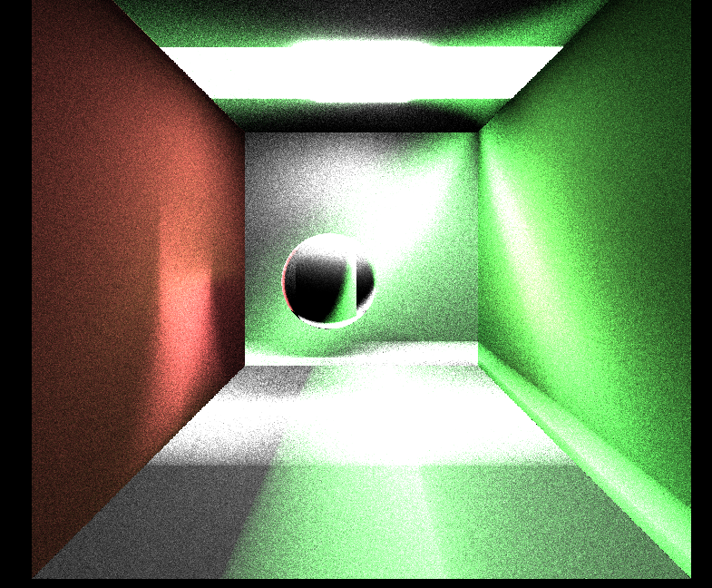

In the above image my rays were not bouncing in random directions and instead were bouncing in the same direction every time they were shot from the camera, causing this artifact.

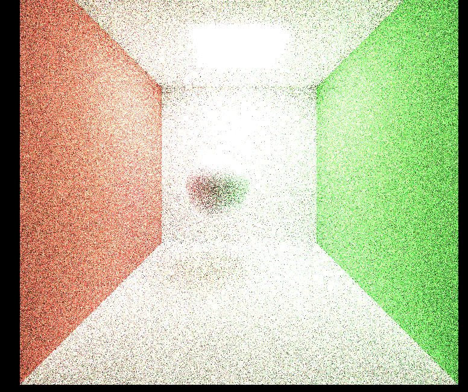

When this image was rendered I was not calculating diffuse albedo by dividing the material color by PI. Instead I was just using the material color as the albedo. I was still dividing by the diffuse pdf though, so at each bounce the color was getting amplified resulting in this blown out image.
